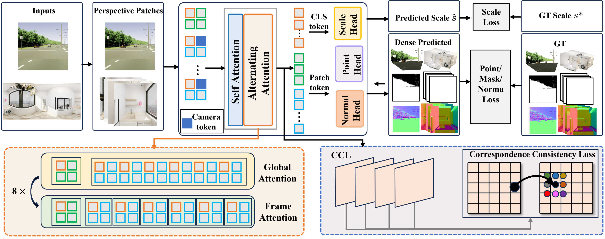

<div align="center">

# DepthMaster

<p align="center"><i>DepthMaster: Unified Monocular Depth Estimation for Perspective and Panoramic Images.</i></p>


[](#)
[](https://polyu-vclab.github.io/DepthMaster-page/)
[](https://huggingface.co/VCLab-PolyU/DepthMaster)
[](LICENSE)


[Pengfei Wang](https://scholar.google.com/citations?hl=en&user=zAAYwRYAAAAJ&view_op=list_works)<sup>1</sup> |
[Shihao Wang](https://scholar.google.com/citations?user=7TWugs4AAAAJ&hl=zh-CN)<sup>1</sup> |
[Liyi Chen](https://scholar.google.com/citations?user=nMev-10AAAAJ&hl=en)<sup>1</sup> |
[Zhiyuan Ma](https://scholar.google.com/citations?user=F15mLDYAAAAJ&hl=en)<sup>1</sup> |
[Guowen Zhang](https://scholar.google.com/citations?user=DxcLKZIAAAAJ&hl=en)<sup>1</sup> |
[Lei Zhang](https://scholar.google.com/citations?user=tAK5l1IAAAAJ&hl=en)<sup>1,&dagger;</sup>

<sup>1</sup> The Hong Kong Polytechnic University

<sup>&dagger;</sup> Corresponding author.

</div>

<p align="center">
  
</p>


<a id="news"></a>
## &#x1F4F0; News

- **2026-06**: Released the [project page](https://polyu-vclab.github.io/DepthMaster-page/), the code repository, and the pretrained checkpoint on [Hugging Face](https://huggingface.co/VCLab-PolyU/DepthMaster).
- **TBA**: Paper and Hugging Face demo.

---


## &#x1F4CC; Quick Links

- [&#x1F4F0; News](#news)
- [&#x1F50D; Overview](#overview)
- [&#x1F527; Installation](#installation)
- [&#x1F680; Quick Start](#quickstart)
- [&#x1F5C2;&#xFE0F; Data Preparation](#data)
- [&#x1F3CB;&#xFE0F; Training](#training)
- [&#x1F4CA; Evaluation](#evaluation)
- [&#x1F4C1; Repository Layout](#layout)
- [&#x1F64F; Acknowledgments](#ack)
- [&#x1F4DA; Citation](#citation)
- [&#x1F4EC; Contact](#contact)

---


<a id="overview"></a>
## &#x1F50D; Overview

**DepthMaster** is a unified monocular depth estimator that works on both
**perspective images** and **equirectangular panoramas**. The same network
backbone is applied to both modalities — panoramic inputs are projected to a
6-face cubemap on the GPU, processed jointly with the perspective branch, and
the predictions are seamlessly re-projected back onto the sphere.

Key features:

- ✅ **Single model, two modalities.** Perspective + equirectangular panorama.
- ✅ **Metric depth output.** Recovers depth in meters as well as scale-/affine-invariant predictions.
- 🏆 **State-of-the-art accuracy on both fronts.** Trained for **250k steps**, DepthMaster achieves top results on standard perspective benchmarks (NYUv2, KITTI, ETH3D, iBims-1, Sintel, DDAD, DIODE, Spring, HAMMER, GSO) *and* on panoramic benchmarks (Stanford2D3DS, Matterport3D, PanoSUNCG).

---


<a id="installation"></a>
## &#x1F527; Installation

DepthMaster has been tested on Linux with **Python 3.10**, **PyTorch 2.4.0**
and **CUDA 12.1**.

```bash
# 1. Create a fresh environment.
conda create -n depthmaster python=3.10 -y
conda activate depthmaster

# 2. Install PyTorch (example: CUDA 12.1; adjust the index URL for your CUDA version).
pip install torch==2.4.0 torchvision --index-url https://download.pytorch.org/whl/cu121

# 3. Install the rest of the dependencies.
pip install -r requirements.txt

# 4. IMPORTANT: install the exact `utils3d` commit pinned by DepthMaster.
#    A different commit can break geometry / panorama utilities at runtime.
pip install --force-reinstall \
    git+https://github.com/EasternJournalist/utils3d.git@3fab839f0be9931dac7c8488eb0e1600c236e183
```

If you only need inference (e.g. to run the [Quick Start](#quickstart)
examples below), the steps above are sufficient. Training additionally
relies on the data preparation step described in [Data Preparation](#data).

### Pretrained checkpoint

The official DepthMaster checkpoint is hosted on Hugging Face at
[**VCLab-PolyU/DepthMaster**](https://huggingface.co/VCLab-PolyU/DepthMaster).
Download it once and reuse the local path everywhere below:

```bash
# Option 1: huggingface-cli (recommended).
huggingface-cli login    # one-off, only if not logged in already
huggingface-cli download VCLab-PolyU/DepthMaster depthmaster.pt \
    --local-dir checkpoints --local-dir-use-symlinks False

# Option 2: direct wget.
mkdir -p checkpoints
wget -O checkpoints/depthmaster.pt \
    https://huggingface.co/VCLab-PolyU/DepthMaster/resolve/main/depthmaster.pt
```

After the command above finishes, the checkpoint will be available at
`checkpoints/depthmaster.pt`. Use this path for the `--pretrained`
argument in [Evaluation](#evaluation) and the `from_pretrained(...)` calls
in [Quick Start](#quickstart).

---


<a id="quickstart"></a>
## &#x1F680; Quick Start

<details open>
<summary><strong>Perspective image inference</strong></summary>

<br>

```python
import torch
import cv2
import numpy as np
from depthmaster.model import DepthMasterModel

device = torch.device("cuda" if torch.cuda.is_available() else "cpu")

# 1. Load a perspective image as a (3, H, W) float tensor in [0, 1].
img_bgr = cv2.imread("path/to/image.jpg")
img_rgb = cv2.cvtColor(img_bgr, cv2.COLOR_BGR2RGB)
img = torch.from_numpy(img_rgb).permute(2, 0, 1).float().to(device) / 255.0

# 2. Load the model.
model = DepthMasterModel.from_pretrained("path/to/depthmaster.pt").to(device).eval()

# 3. Run inference. `fov_x` is optional; omit it to let the model predict its own FOV.
with torch.inference_mode():
    output = model.infer(img, apply_mask=True, use_fp16=True)

depth      = output["depth"]       # (H, W) metric depth in meters
points     = output["points"]      # (H, W, 3) metric point map
intrinsics = output["intrinsics"]  # (3, 3) normalized intrinsics
mask       = output["mask"]        # (H, W) bool

# 4. Save a colorized depth visualization.
from depthmaster.utils.vis import colorize_depth
depth_np = np.where(mask.cpu().numpy(), depth.cpu().numpy(), np.inf)
cv2.imwrite("depth.png", cv2.cvtColor(colorize_depth(depth_np), cv2.COLOR_RGB2BGR))
```

</details>

<details>
<summary><strong>Panoramic (equirectangular) inference</strong></summary>

<br>

```python
import sys, torch, cv2
from depthmaster.model import DepthMasterModel
sys.path.insert(0, "eval_panorama")  # so that the helpers below are importable
from eval_panorama.eval import (
    erp_to_cubemap_gpu,
    cubemap_to_erp_gpu,
    _get_camera_params_cached,
)

device = torch.device("cuda" if torch.cuda.is_available() else "cpu")

# 1. Load an equirectangular panorama as a (1, 3, H, 2H) float tensor in [0, 255].
pano_bgr = cv2.imread("path/to/panorama.jpg")
pano_rgb = cv2.cvtColor(pano_bgr, cv2.COLOR_BGR2RGB)
pano = torch.from_numpy(pano_rgb).permute(2, 0, 1).float()[None].to(device)
H, W = pano.shape[-2:]

# 2. Load the model.
model = DepthMasterModel.from_pretrained("path/to/depthmaster.pt").to(device).eval()

# 3. ERP -> Cubemap (FOV = 95 deg, face resolution 518).
cubemap_size, fov_deg = 518, 95.0
faces = erp_to_cubemap_gpu(pano / 255.0, face_w=cubemap_size, fov_deg=fov_deg)

# 4. Run DepthMaster on the 6 cubemap faces jointly.
W2C, K = _get_camera_params_cached(fov_deg, cubemap_size, device, torch.float32)
with torch.inference_mode(), torch.autocast(device_type=device.type, dtype=torch.float16):
    raw = model.forward(
        faces.to(model.dtype),
        num_tokens=0,
        camera_type="Panorama",
        W2C=W2C[None].to(model.dtype),
        intrinsics=K[None].to(model.dtype),
    )

points = raw["pts3d"].float() * raw["metric_scale"].float()[:, None, None, None]
points = points.squeeze(0)                                       # (6, H, W, 3)
depth_faces = torch.sqrt((points * points).sum(dim=-1))          # (6, H, W) range depth

# 5. Cubemap -> ERP (with soft-blending to remove face seams).
erp_depth = cubemap_to_erp_gpu(depth_faces, pano_h=H, pano_w=W, fov_deg=fov_deg)
erp_depth = erp_depth.clamp_min(1e-6).cpu().numpy()              # (H, W)
```

</details>

For full evaluation pipelines (with alignment, metrics and visualization),
use `bash eval_perspective.sh` or `bash eval_panorama.sh` — see
[Evaluation](#evaluation).

---


<a id="data"></a>
## &#x1F5C2;&#xFE0F; Data Preparation

All paths inside the configuration files are placeholders of the form
`<DATA_ROOT>/<dataset>`. Replace them with the actual locations of the
datasets on your machine.

<details>
<summary><strong>Training data</strong></summary>

<br>

DepthMaster is trained on a mixture of perspective and panoramic datasets.
You can either:

1. **Use a public mixture.** Most academic depth datasets (Hypersim,
   BlendedMVS, ARKitScenes, Structured3D, Matterport3D, ...) are already
   covered by the data preparation scripts shipped with
   [CUT3R](https://github.com/CUT3R/CUT3R) and
   [depth-anything-3](https://github.com/bytedance-seed/depth-anything-3).
   Once a dataset is processed by either of those repositories, simply
   point a new entry in
   [`configs/train/depthmaster_train.json`](configs/train/depthmaster_train.json)
   at the resulting directory.
2. **Bring your own data for finetuning.** A custom dataset only has to
   produce `(image, depth, intrinsics)` triplets (or, for panoramas,
   ERP `(image, depth)` pairs). Drop the assets under any folder, register a
   reader in
   [`depthmaster/train/dataset_readers.py`](depthmaster/train/dataset_readers.py)
   following the existing `load_hypersim` / `load_structured3d` patterns,
   and add an entry to `configs/train/depthmaster_train.json`. No further
   changes to the training loop are required.

The released configuration ships with a **minimal mixture** (Hypersim +
Structured3D) that exercises both modalities and is sufficient as a
starting point for finetuning.

</details>

<details>
<summary><strong>Perspective benchmark data</strong></summary>

<br>

Our perspective evaluation re-uses the unified benchmark suite released
with [MoGe](https://github.com/microsoft/MoGe). Download the processed
datasets from
[Huggingface Datasets](https://huggingface.co/datasets/Ruicheng/monocular-geometry-evaluation):

```bash
mkdir -p data/eval
huggingface-cli login    # one-off, only if not logged in already
huggingface-cli download Ruicheng/monocular-geometry-evaluation \
    --repo-type dataset \
    --local-dir data/eval \
    --local-dir-use-symlinks False

# Unzip every benchmark.
cd data/eval
unzip '*.zip'
# rm *.zip   # optional: drop archives after extraction
```

Then edit
[`configs/eval/all_benchmarks.json`](configs/eval/all_benchmarks.json) so
that the `path` field of each benchmark points to the corresponding
unzipped directory under `data/eval/`.

</details>

<details>
<summary><strong>Panoramic benchmark data</strong></summary>

<br>

Our panoramic evaluation follows the protocol of
[DA-2](https://github.com/EnVision-Research/DA-2). Download the processed
panoramic benchmarks from
[Huggingface Datasets](https://huggingface.co/datasets/haodongli/DA-2-Evaluation):

```bash
mkdir -p data/eval_panorama
huggingface-cli login    # one-off, only if not logged in already
hf download --repo-type dataset haodongli/DA-2-Evaluation \
    --local-dir data/eval_panorama

# Unzip every benchmark archive.
cd data/eval_panorama
for f in *.tar.gz; do tar -zxvf "$f"; done
```

Then update `evaluation.datasets_dir` in
[`eval_panorama/configs/eval_panorama.json`](eval_panorama/configs/eval_panorama.json)
so that it points to your local `data/eval_panorama` directory. The split
files used during evaluation are bundled under
[`eval_panorama/eval/datasets/splits/`](eval_panorama/eval/datasets/splits/).

</details>

---


<a id="training"></a>
## &#x1F3CB;&#xFE0F; Training

```bash
# Single-node, 8 GPUs.
bash train.sh 0 1 127.0.0.1

# Multi-node training (e.g. 2 nodes):
#   on the master node:
bash train.sh 0 2 192.168.1.1
#   on the worker node:
bash train.sh 1 2 192.168.1.1

# You can override any Hydra field on the command line:
bash train.sh 0 1 127.0.0.1 trainer.max_steps=200000 paths.root_dir=/path/to/output
```

The default training schedule lives in
[`training/configs/train/depthmaster.yaml`](training/configs/train/depthmaster.yaml)
(**250k steps**, cosine decay, 1.5k warmup), which matches the schedule used
to produce the numbers reported in the paper. To warm-start from an existing
checkpoint, set `wrapper.pretrained=/path/to/ckpt.pt` on the command line,
or edit
[`training/configs/wrapper/depthmaster.yaml`](training/configs/wrapper/depthmaster.yaml).

---


<a id="evaluation"></a>
## &#x1F4CA; Evaluation

### Perspective benchmarks

```bash
bash eval_perspective.sh /path/to/depthmaster.pt output/eval_perspective.json
```

This internally runs:

```bash
python depthmaster/scripts/eval_baseline.py \
    --baseline baselines/depthmaster.py \
    --config configs/eval/all_benchmarks.json \
    --output output/eval_perspective.json \
    --pretrained /path/to/depthmaster.pt \
    --resolution_level 9 \
    --fp16
```

Pass `--save_per_sample` to additionally export per-sample metrics under
`output/eval_perspective_per_sample/<benchmark>.json`.

### Panoramic benchmarks

```bash
bash eval_panorama.sh /path/to/depthmaster.pt output/eval_panorama
```

The panoramic evaluator first renders each ERP image into a 6-face cubemap
(FOV = 95°, face resolution 518×518), runs DepthMaster on each face, and
re-projects the predictions back onto the sphere before computing
scale-invariant and affine-invariant metrics. The default alignment list
is `["dm_scale", "dm_affine"]` (configurable in
[`eval_panorama/configs/eval_panorama.json`](eval_panorama/configs/eval_panorama.json)).

---


<a id="layout"></a>
## &#x1F4C1; Repository Layout

```
DepthMaster/
├── depthmaster/                          # Core package: model, training utilities, alignment,
│   │                                     # panorama helpers, dataset readers, ...
│   ├── model/model.py                    # DepthMaster model definition
│   ├── train/                            # Loss functions, equirect <-> cubemap utilities, ...
│   ├── test/                             # Evaluation interfaces (baseline / dataloader / metrics)
│   ├── utils/                            # Alignment, geometry, panorama helpers, ...
│   └── scripts/eval_baseline.py          # Perspective evaluation entry point
├── baselines/depthmaster.py              # DepthMaster wrapper for `eval_baseline.py`
├── configs/
│   ├── train/depthmaster_train.json      # Dataset mixture used during training
│   └── eval/all_benchmarks.json          # Perspective benchmark definitions
├── training/                             # PyTorch Lightning training framework
│   ├── launch.py
│   ├── wrapper.py                        # Lightning wrapper around DepthMasterModel
│   ├── data/datamodule.py
│   └── configs/                          # Hydra configs (train / wrapper / data / paths)
├── eval_panorama/                        # Panoramic evaluation
│   ├── eval.py                           # ERP -> Cubemap -> ERP evaluation pipeline (GPU)
│   ├── eval/                             # Datasets, alignment, metrics
│   └── configs/eval_panorama.json
├── train.sh                              # Multi-node DDP training launcher
├── eval_perspective.sh                   # Perspective benchmark launcher
├── eval_panorama.sh                      # Panoramic benchmark launcher
├── assets/teaser.png                     # Teaser image used in this README
├── requirements.txt
└── LICENSE
```

---


<a id="ack"></a>
## &#x1F64F; Acknowledgments

This project builds on top of several outstanding open-source efforts.
We sincerely thank the authors and maintainers of:

- [**MoGe**](https://github.com/microsoft/MoGe) — geometry-aware monocular depth/point estimator (training infrastructure and benchmark suite).
- [**DA-2**](https://github.com/EnVision-Research/DA-2) — panoramic evaluation pipeline reference and panoramic benchmark release.
- [**CUT3R**](https://github.com/CUT3R/CUT3R) — academic dataset preparation pipeline.
- [**depth-anything-3**](https://github.com/bytedance-seed/depth-anything-3) — academic dataset preparation pipeline.

---


<a id="citation"></a>
## &#x1F4DA; Citation

If you find DepthMaster useful for your research, please consider citing:

```bibtex
@article{wang2026depthmaster,
  title   = {DepthMaster: A Unified Perspective and Panoramic Monocular Depth Estimator},
  author  = {Wang, Pengfei and Wang, Shihao and Chen, Liyi and Ma, Zhiyuan and Zhang, Guowen and Zhang, Lei},
  journal = {arXiv preprint},
  year    = {2026}
}
```

---


<a id="contact"></a>
## &#x1F4EC; Contact

If you have any questions or suggestions, please feel free to open an issue
or contact [pengfei.wang@connect.polyu.hk](mailto:pengfei.wang@connect.polyu.hk).

---


## License

This project is released under the [MIT License](LICENSE).
